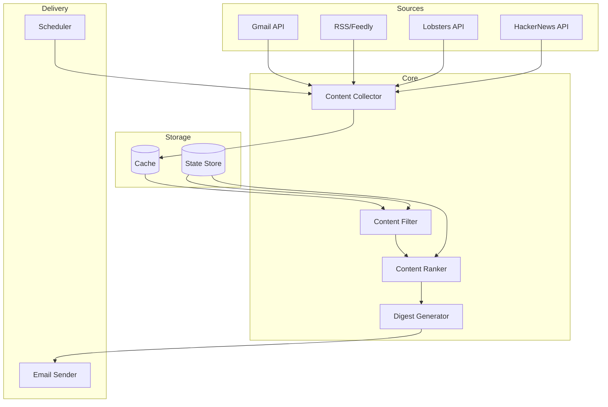

# Daily Email and RSS Digest - Architecture Design

## Architecture Overview

The Daily Digest application is a Python-based service that aggregates content from multiple sources (Gmail, RSS feeds, Lobsters, HackerNews), filters it based on user preferences, and delivers a curated daily digest via email. The system follows a modular architecture with clear separation between data sources, content processing, and delivery mechanisms.



## File Changes

### New Files to Create

```
projects/daily-email-and-rss-digest/
├── src/
│   ├── __init__.py
│   ├── main.py                    # Entry point and scheduler
│   ├── config.py                  # Configuration management
│   ├── models.py                  # Data models
│   ├── sources/
│   │   ├── __init__.py
│   │   ├── base.py               # Abstract source interface
│   │   ├── gmail.py              # Gmail integration
│   │   ├── rss.py                # RSS/Feedly integration  
│   │   ├── lobsters.py           # Lobsters integration
│   │   └── hackernews.py         # HackerNews integration
│   ├── processing/
│   │   ├── __init__.py
│   │   ├── collector.py          # Content collection orchestrator
│   │   ├── filter.py             # Content filtering engine
│   │   ├── ranker.py             # Content ranking/scoring
│   │   └── deduplicator.py       # Duplicate detection
│   ├── generation/
│   │   ├── __init__.py
│   │   ├── generator.py          # Digest generator
│   │   └── templates.py          # Email templates
│   ├── delivery/
│   │   ├── __init__.py
│   │   └── email_sender.py       # Email delivery
│   ├── storage/
│   │   ├── __init__.py
│   │   ├── cache.py              # Content caching
│   │   └── state.py              # State persistence
│   └── utils/
│       ├── __init__.py
│       ├── rate_limiter.py       # API rate limiting
│       └── logging.py            # Logging utilities
├── tests/
│   ├── __init__.py
│   ├── test_sources/
│   │   ├── test_gmail.py
│   │   ├── test_rss.py
│   │   ├── test_lobsters.py
│   │   └── test_hackernews.py
│   ├── test_processing/
│   │   ├── test_collector.py
│   │   ├── test_filter.py
│   │   └── test_ranker.py
│   └── test_generation/
│       └── test_generator.py
├── config/
│   ├── config.yaml               # Default configuration
│   └── config.schema.json        # Configuration schema
├── requirements.txt              # Python dependencies
├── Dockerfile                    # Container definition
└── docker-compose.yml           # Local development setup
```

## API Specifications

### Core Interfaces

#### ContentSource (base.py)
```python
from abc import ABC, abstractmethod
from typing import List, Dict, Any, Optional
from datetime import datetime
from dataclasses import dataclass

@dataclass
class ContentItem:
    """Represents a single content item from any source"""
    id: str                      # Unique identifier
    source: str                  # Source name (gmail, rss, etc)
    title: str                   # Item title/subject
    summary: str                 # Brief summary/preview
    content: Optional[str]       # Full content if available
    author: str                  # Author/sender
    url: Optional[str]          # Link to original
    timestamp: datetime          # Publication/receipt time
    tags: List[str]             # Categorization tags
    metadata: Dict[str, Any]    # Source-specific metadata
    score: float = 0.0          # Relevance score (set by ranker)

class ContentSource(ABC):
    """Abstract base class for all content sources"""
    
    @abstractmethod
    def authenticate(self) -> bool:
        """Authenticate with the source service"""
        pass
    
    @abstractmethod
    def fetch_content(self, since: datetime, limit: int = 100) -> List[ContentItem]:
        """Fetch content since the specified timestamp"""
        pass
    
    @abstractmethod
    def get_source_name(self) -> str:
        """Return the source identifier"""
        pass
```

#### GmailSource (gmail.py)
```python
class GmailSource(ContentSource):
    """Gmail content source using Google API"""
    
    def __init__(self, credentials_path: str, labels: List[str], 
                 sender_filters: List[str]):
        self.credentials_path = credentials_path
        self.labels = labels  # Gmail labels to include
        self.sender_filters = sender_filters  # Important senders
        self.service = None
    
    def authenticate(self) -> bool:
        """OAuth2 authentication with Gmail API"""
        # Uses google-auth-oauthlib for OAuth2 flow
        pass
    
    def fetch_content(self, since: datetime, limit: int = 100) -> List[ContentItem]:
        """
        Fetch emails matching criteria:
        - From specified labels
        - From important senders
        - Received after 'since' timestamp
        """
        pass
```

#### RSSSource (rss.py)
```python
class RSSSource(ContentSource):
    """RSS/Feedly content source"""
    
    def __init__(self, feed_urls: List[str], feedly_token: Optional[str] = None):
        self.feed_urls = feed_urls
        self.feedly_token = feedly_token
        self.parser = None
    
    def fetch_content(self, since: datetime, limit: int = 100) -> List[ContentItem]:
        """
        Fetch RSS items from feeds:
        - Direct RSS URLs using feedparser
        - Feedly API if token provided
        """
        pass
```

#### ContentFilter (filter.py)
```python
from typing import List, Set
import re

class ContentFilter:
    """Filters content based on user preferences"""
    
    def __init__(self, config: Dict[str, Any]):
        self.include_keywords: Set[str] = set(config.get('include_keywords', []))
        self.exclude_keywords: Set[str] = set(config.get('exclude_keywords', []))
        self.include_patterns: List[re.Pattern] = []
        self.exclude_patterns: List[re.Pattern] = []
        self.min_score: float = config.get('min_score', 0.3)
        
    def filter(self, items: List[ContentItem]) -> List[ContentItem]:
        """
        Apply filtering rules:
        1. Remove items matching exclude patterns/keywords
        2. Boost items matching include patterns/keywords
        3. Remove items below minimum score threshold
        """
        pass
    
    def matches_criteria(self, item: ContentItem) -> bool:
        """Check if item matches filter criteria"""
        pass
```

#### ContentRanker (ranker.py)
```python
from typing import List, Dict
import numpy as np

class ContentRanker:
    """Ranks content by relevance and importance"""
    
    def __init__(self, config: Dict[str, Any]):
        self.weights = {
            'keyword_match': 0.3,
            'recency': 0.2,
            'source_priority': 0.2,
            'engagement': 0.15,
            'author_importance': 0.15
        }
        self.source_priorities = config.get('source_priorities', {})
        self.important_authors = set(config.get('important_authors', []))
        
    def rank(self, items: List[ContentItem]) -> List[ContentItem]:
        """
        Score and sort items by relevance:
        1. Calculate individual scores
        2. Apply weighted combination
        3. Sort by final score
        """
        pass
    
    def calculate_score(self, item: ContentItem) -> float:
        """Calculate relevance score for a single item"""
        pass
```

#### DigestGenerator (generator.py)
```python
from typing import List
from jinja2 import Template

class DigestGenerator:
    """Generates formatted digest from content items"""
    
    def __init__(self, template_path: str, max_items: int = 25):
        self.template = self.load_template(template_path)
        self.max_items = max_items
        
    def generate(self, items: List[ContentItem], 
                 date: datetime) -> str:
        """
        Generate HTML digest:
        1. Group items by source
        2. Truncate to max items
        3. Render using template
        """
        pass
    
    def generate_text_version(self, items: List[ContentItem],
                             date: datetime) -> str:
        """Generate plain text version for multipart email"""
        pass
```

## Data Flow

### 1. Content Collection Flow
```
Scheduler triggers → Collector.run()
  → For each source:
    → source.fetch_content(since_last_run)
    → Deduplicator.check(items)
    → Cache.store(items)
  → Return aggregated items
```

### 2. Content Processing Flow
```
Raw items → Filter.filter(items)
  → Remove excluded content
  → Apply keyword matching
  → Ranker.rank(filtered_items)
    → Calculate relevance scores
    → Sort by score
  → Return top N items
```

### 3. Digest Generation Flow
```
Ranked items → Generator.generate(items)
  → Group by source/category
  → Apply template formatting
  → Generate HTML + text versions
  → EmailSender.send(digest)
```

## Error Handling

### API Failures
```python
class SourceError(Exception):
    """Base exception for source-related errors"""
    pass

class AuthenticationError(SourceError):
    """Authentication/authorization failure"""
    pass

class RateLimitError(SourceError):
    """API rate limit exceeded"""
    def __init__(self, retry_after: int):
        self.retry_after = retry_after
```

### Retry Strategy
- Exponential backoff for transient failures
- Maximum 3 retries per source
- Continue with partial data if sources fail
- Log failures for monitoring

### Graceful Degradation
1. If Gmail fails → Continue with other sources
2. If HackerNews overwhelmed → Use cached data
3. If email delivery fails → Store digest for manual retrieval
4. If all sources fail → Send notification of failure

## Testing Strategy

### Unit Tests

#### Source Tests (test_sources/)
- Mock API responses for each source
- Test authentication flows
- Test content parsing and normalization
- Test rate limit handling
- Test error conditions

#### Processing Tests (test_processing/)
- Test filtering logic with various criteria
- Test ranking algorithm correctness
- Test deduplication logic
- Test edge cases (empty input, all filtered out)

#### Generation Tests (test_generation/)
- Test template rendering
- Test grouping and sorting
- Test truncation logic
- Test multipart email generation

### Integration Tests
```python
def test_end_to_end_flow():
    """Test complete flow with mock data"""
    # 1. Mock sources return test data
    # 2. Process through filter/ranker
    # 3. Generate digest
    # 4. Verify output format
```

### Performance Tests
```python
def test_large_volume_processing():
    """Test with 1000+ items"""
    # Verify memory usage stays reasonable
    # Verify processing time < 30 seconds
```

## Implementation Order

### Phase 1: Core Infrastructure (Days 1-2)
1. `config.py` - Configuration management
2. `models.py` - Data models
3. `sources/base.py` - Abstract interface
4. `storage/cache.py` - Basic caching
5. `utils/logging.py` - Logging setup

### Phase 2: Single Source MVP (Days 3-4)
1. `sources/rss.py` - RSS implementation (simplest)
2. `processing/collector.py` - Basic collection
3. `processing/filter.py` - Basic filtering
4. `generation/generator.py` - Simple digest
5. `delivery/email_sender.py` - Email delivery

### Phase 3: Additional Sources (Days 5-7)
1. `sources/lobsters.py` - Lobsters integration
2. `sources/gmail.py` - Gmail integration (OAuth2)
3. `processing/deduplicator.py` - Deduplication
4. `utils/rate_limiter.py` - Rate limiting

### Phase 4: Advanced Features (Days 8-9)
1. `sources/hackernews.py` - HackerNews (with filtering)
2. `processing/ranker.py` - Scoring algorithm
3. `generation/templates.py` - Rich templates
4. `storage/state.py` - Persistent state

### Phase 5: Production Ready (Day 10)
1. `main.py` - Scheduler and orchestration
2. Docker configuration
3. Comprehensive tests
4. Documentation
5. Deployment configuration

## Configuration Schema

```yaml
# config/config.yaml
digest:
  schedule: "0 7 * * *"  # Daily at 7 AM
  max_items: 25
  delivery:
    smtp_host: "smtp.gmail.com"
    smtp_port: 587
    from_address: "digest@example.com"
    to_addresses: ["user@example.com"]

sources:
  gmail:
    enabled: true
    credentials_path: "credentials/gmail.json"
    labels: ["INBOX", "Important"]
    sender_filters: ["@important-domain.com"]
    
  rss:
    enabled: true
    feeds:
      - "https://example.com/feed.xml"
    feedly_token: null  # Optional
    
  lobsters:
    enabled: true
    min_score: 5
    tags: ["programming", "distributed"]
    
  hackernews:
    enabled: false  # Disabled by default
    min_score: 50
    max_items_per_day: 10

filtering:
  include_keywords:
    - "python"
    - "distributed systems"
    - "architecture"
  exclude_keywords:
    - "blockchain"
    - "crypto"
  min_score: 0.3

ranking:
  source_priorities:
    gmail: 1.0
    lobsters: 0.8
    rss: 0.7
    hackernews: 0.5
  important_authors:
    - "author@example.com"
```

## Security Considerations

1. **Credential Storage**: Use environment variables or secure vault
2. **OAuth2 Tokens**: Store refresh tokens encrypted
3. **Rate Limiting**: Implement per-source rate limits
4. **Input Sanitization**: Sanitize HTML content before including
5. **SMTP Authentication**: Use app-specific passwords
6. **API Keys**: Rotate regularly, monitor usage

## Monitoring and Observability

1. **Metrics to Track**:
   - Items collected per source
   - Filter pass-through rate
   - Digest generation time
   - Email delivery success rate
   - API rate limit usage

2. **Logging Levels**:
   - ERROR: Failed sources, delivery failures
   - WARNING: Rate limits approached, partial failures
   - INFO: Digest sent, items processed
   - DEBUG: Individual item processing

3. **Health Checks**:
   - Source authentication status
   - Last successful run timestamp
   - Cache hit rate
   - Error rate over time

## Assumptions and Constraints

1. **Assumptions**:
   - Python 3.9+ environment
   - Internet connectivity for API access
   - SMTP server available for email delivery
   - User has necessary API credentials
   - Daily digest sufficient (not real-time)

2. **Constraints**:
   - API rate limits (Gmail: 250 quota units/user/second)
   - Memory usage under 512MB
   - Processing time under 60 seconds
   - Digest size under 100KB
   - Maximum 100 items per source per day

3. **Open Questions** (to be resolved in implementation):
   - Specific filtering criteria for user interests
   - Preferred digest format/styling
   - Delivery time preference
   - Whether to include images/attachments
   - Long-term storage requirements for historical digests