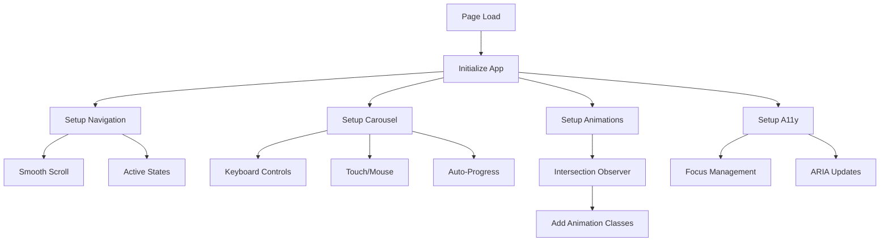

# Design Architecture - Design Agency Website

## Architecture Overview

This document provides a deterministic design and implementation specification for a minimalist, typography-focused design agency website. The architecture emphasizes bold visual impact through color and space, with zero reliance on traditional imagery.

## Design System

### Color Palette
- **Primary**: `#FF006E` (Electric Pink) - Bold accent for key elements
- **Secondary**: `#FB5607` (Vibrant Orange) - Supporting accent
- **Background**: `#0A0A0A` (Near Black) - Main background
- **Surface**: `#1A1A1A` (Dark Gray) - Card/section backgrounds
- **Text Primary**: `#FFFFFF` (Pure White) - Main text
- **Text Secondary**: `#B0B0B0` (Light Gray) - Supporting text

### Typography System
- **Display Font**: `"Inter Tight", sans-serif` (Variable weight 100-900)
  - Hero: 120px/0.9 weight-200
  - H1: 72px/1.0 weight-300
  - H2: 48px/1.1 weight-400
  - H3: 32px/1.2 weight-500
- **Body Font**: `"Inter", sans-serif`
  - Body Large: 18px/1.6 weight-400
  - Body Regular: 16px/1.6 weight-400
  - Body Small: 14px/1.5 weight-400
  - Caption: 12px/1.4 weight-500

### Spacing System
- Base unit: 8px
- Scale: 8, 16, 24, 32, 48, 64, 96, 128, 192px
- Container max-width: 1440px
- Side padding: 32px (mobile), 64px (tablet), 96px (desktop)

## File Changes

### Files to Create

#### 1. `/projects/design-agency-website/src/index.html`
**Purpose**: Main HTML document
**Structure**:
```html
<!DOCTYPE html>
<html lang="en">
<head>
  <meta charset="UTF-8">
  <meta name="viewport" content="width=device-width, initial-scale=1.0">
  <title>FLUX — Design Agency</title>
  <link rel="stylesheet" href="styles/main.css">
  <link rel="preconnect" href="https://fonts.googleapis.com">
  <link href="https://fonts.googleapis.com/css2?family=Inter:wght@400;500&family=Inter+Tight:wght@100..900&display=swap" rel="stylesheet">
</head>
<body>
  <nav id="navigation">...</nav>
  <main id="main-content">
    <section id="hero">...</section>
    <section id="ethos">...</section>
    <section id="values">...</section>
    <section id="services">...</section>
    <section id="contact">...</section>
  </main>
  <footer id="footer">...</footer>
  <script src="scripts/main.js"></script>
</body>
</html>
```

#### 2. `/projects/design-agency-website/src/styles/main.css`
**Purpose**: Primary stylesheet
**Sections**:
- CSS custom properties for design tokens
- Reset and base styles
- Typography classes
- Layout utilities
- Component styles (navigation, hero, sections)
- Animation keyframes
- Responsive breakpoints (768px, 1024px, 1440px)

#### 3. `/projects/design-agency-website/src/scripts/main.js`
**Purpose**: Interactive behaviors
**Functions**:
- `initNavigation()` - Smooth scroll, active state management
- `initValueCarousel()` - Horizontal scroll for values with keyboard support
- `initScrollAnimations()` - Intersection Observer for reveal animations
- `initThemeToggle()` - Optional light theme switcher
- `initAccessibility()` - Focus management, ARIA updates

## API Specifications

### JavaScript Module Structure

```javascript
// main.js
const App = {
  config: {
    scrollOffset: 80,
    animationDuration: 600,
    intersectionThreshold: 0.2
  },
  
  init() {
    this.initNavigation();
    this.initValueCarousel();
    this.initScrollAnimations();
    this.initAccessibility();
  },
  
  initNavigation() {
    // Implementation
  },
  
  initValueCarousel() {
    // Implementation
  },
  
  initScrollAnimations() {
    // Implementation
  },
  
  initAccessibility() {
    // Implementation
  }
};
```

### CSS Architecture

```css
/* Custom Properties */
:root {
  --color-primary: #FF006E;
  --color-secondary: #FB5607;
  --color-bg: #0A0A0A;
  --color-surface: #1A1A1A;
  --color-text-primary: #FFFFFF;
  --color-text-secondary: #B0B0B0;
  
  --font-display: "Inter Tight", sans-serif;
  --font-body: "Inter", sans-serif;
  
  --space-xs: 8px;
  --space-sm: 16px;
  --space-md: 32px;
  --space-lg: 64px;
  --space-xl: 96px;
  --space-xxl: 128px;
}

/* Component Classes */
.hero {}
.value-card {}
.service-block {}
.nav-link {}
```

## Data Flow



## Component Specifications

### Hero Section
- Full viewport height (100vh - nav height)
- Large typography with animated entrance
- Gradient text effect on key words
- Subtle parallax on scroll

### Values Carousel
- Horizontal scrolling container
- 5 value cards with distinct colors from palette
- Keyboard navigation (arrow keys)
- Touch/swipe support
- Progress indicators
- Auto-pause on interaction

### Services Grid
- CSS Grid layout (auto-fit, minmax(300px, 1fr))
- Hover effects with color transitions
- Staggered entrance animations
- Number prefixes (01, 02, 03, etc.)

### Navigation
- Fixed position with blur backdrop
- Smooth scroll to sections
- Active section highlighting
- Mobile hamburger menu (off-canvas)

## Error Handling

### JavaScript Errors
- Wrap all initialization in try-catch blocks
- Graceful fallback for missing DOM elements
- Console warnings for non-critical failures
- Feature detection for modern APIs

### CSS Fallbacks
- Progressive enhancement approach
- Fallback fonts specified
- CSS `@supports` for modern features
- Mobile-first responsive design

### Accessibility Failures
- ARIA labels on all interactive elements
- Keyboard navigation for all features
- Focus visible indicators
- Screen reader announcements for dynamic content

## Testing Strategy

### Visual Testing
1. **Cross-browser compatibility**
   - Chrome, Firefox, Safari, Edge latest versions
   - Test CSS Grid, Flexbox, custom properties
   - Verify font loading and rendering

2. **Responsive breakpoints**
   - Mobile: 320px, 375px, 414px
   - Tablet: 768px, 834px
   - Desktop: 1024px, 1440px, 1920px

3. **Color contrast**
   - WCAG AA compliance minimum
   - Test all text/background combinations
   - Verify focus indicators visibility

### Functional Testing
1. **Navigation**
   - Smooth scroll works to all sections
   - Active states update correctly
   - Mobile menu opens/closes properly
   - Keyboard navigation (Tab, Enter, Escape)

2. **Values Carousel**
   - Arrow key navigation works
   - Touch/swipe gestures responsive
   - Auto-progress pauses on interaction
   - Progress indicators update correctly

3. **Animations**
   - Entrance animations trigger at correct scroll positions
   - No animation conflicts or jumps
   - Respects prefers-reduced-motion

### Performance Testing
1. **Page Load**
   - First Contentful Paint < 2s
   - Time to Interactive < 3s
   - Cumulative Layout Shift < 0.1

2. **Runtime Performance**
   - Smooth 60fps scrolling
   - No JavaScript blocking main thread
   - Efficient DOM manipulation

## Implementation Order

1. **Phase 1: Structure & Base Styles**
   - Create index.html with semantic markup
   - Implement CSS reset and design tokens
   - Add typography styles
   - Setup responsive grid system

2. **Phase 2: Components**
   - Build navigation component
   - Implement hero section
   - Create values carousel structure
   - Add services and contact sections

3. **Phase 3: Interactivity**
   - Add smooth scrolling
   - Implement carousel controls
   - Setup scroll-triggered animations
   - Add hover/focus states

4. **Phase 4: Polish**
   - Fine-tune animations timing
   - Optimize performance
   - Add accessibility enhancements
   - Cross-browser testing

## Assumptions

1. Modern browser support only (ES6+, CSS Grid, Custom Properties)
2. No IE11 support required
3. JavaScript enabled (with graceful degradation)
4. Google Fonts CDN accessible
5. Single-page application (no routing needed)

## Edge Cases

1. **Very long agency values text**: Truncate with ellipsis after 3 lines
2. **JavaScript disabled**: Site remains navigable with jump links
3. **Slow network**: Implement font-display: swap for web fonts
4. **High contrast mode**: Ensure borders/outlines visible
5. **Print styles**: Hide navigation, simplify layout
6. **No mouse/touch**: Full keyboard navigation support

## Future Considerations

- Add page transitions if multi-page expansion needed
- Implement CMS integration points for content management
- Add analytics tracking hooks
- Consider WebGL for advanced animations
- Prepare for internationalization (RTL support)