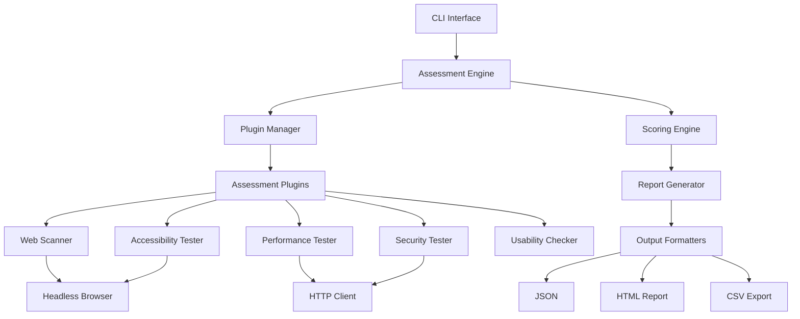
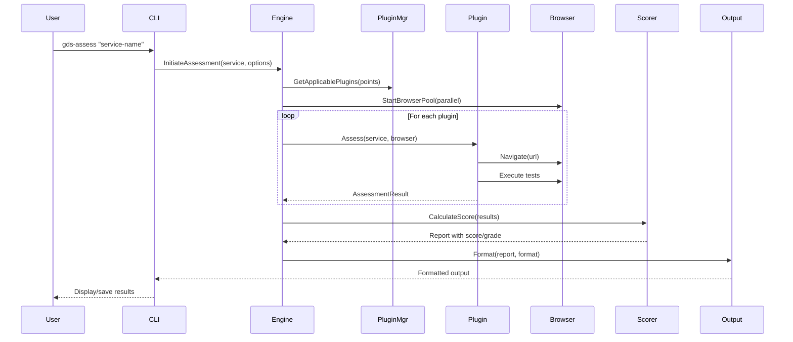

# GDS Service Standard Assessment Tool - Architecture Design

## Architecture Overview

The GDS Service Standard Assessment Tool is a Go-based CLI application that assesses government web services against the 14-point GDS service standard using real-time, automated testing capabilities.



## File Changes

### New Files to Create

```
projects/tool-for-assessing-the-service-standard/
├── src/
│   ├── main.go                    # CLI entry point
│   ├── cmd/
│   │   ├── root.go                # Root command setup
│   │   ├── assess.go              # Main assess command
│   │   └── version.go             # Version command
│   ├── core/
│   │   ├── engine.go              # Assessment engine
│   │   ├── interfaces.go          # Core interfaces
│   │   └── types.go               # Core types
│   ├── plugins/
│   │   ├── plugin.go              # Plugin interface
│   │   ├── manager.go             # Plugin manager
│   │   ├── web/
│   │   │   ├── scanner.go         # Web content scanner
│   │   │   └── crawler.go         # Site crawler
│   │   ├── accessibility/
│   │   │   ├── axe.go            # Axe-core integration
│   │   │   └── wcag.go           # WCAG checker
│   │   ├── security/
│   │   │   ├── headers.go         # Security headers
│   │   │   └── https.go          # HTTPS checker
│   │   ├── performance/
│   │   │   └── metrics.go        # Performance metrics
│   │   └── usability/
│   │       ├── mobile.go          # Mobile friendliness
│   │       └── navigation.go      # Navigation checker
│   ├── standards/
│   │   ├── gds.go                 # GDS standard definitions
│   │   └── points.go              # Standard point implementations
│   ├── scoring/
│   │   ├── scorer.go              # Scoring engine
│   │   └── grader.go              # Grading logic
│   ├── browser/
│   │   ├── browser.go             # Browser interface
│   │   ├── chromium.go            # Chromium/CDP implementation
│   │   └── pool.go                # Browser pool management
│   ├── output/
│   │   ├── formatter.go           # Output formatter interface
│   │   ├── json.go                # JSON formatter
│   │   ├── html.go                # HTML report generator
│   │   └── csv.go                 # CSV exporter
│   └── config/
│       ├── config.go              # Configuration management
│       └── defaults.go            # Default settings
├── tests/
│   ├── integration/
│   │   └── assess_test.go         # End-to-end tests
│   └── unit/
│       ├── engine_test.go         # Engine unit tests
│       ├── plugins_test.go        # Plugin tests
│       └── scoring_test.go        # Scoring tests
├── go.mod                          # Go module definition
├── go.sum                          # Dependency checksums
├── Makefile                        # Build and test commands
└── .goreleaser.yml                 # Release configuration
```

## API Specifications

### Core Interfaces

```go
// core/interfaces.go
package core

import (
    "context"
    "time"
)

// Service represents a government service to assess
type Service struct {
    Name        string
    URL         string
    EntryPoint  string
    Metadata    map[string]string
}

// AssessmentResult represents the result of a single assessment point
type AssessmentResult struct {
    PointID     string
    PointName   string
    Status      AssessmentStatus
    Score       float64  // 0.0 to 1.0
    Evidence    []Evidence
    Errors      []error
    Duration    time.Duration
    Timestamp   time.Time
}

// AssessmentStatus represents the status of an assessment
type AssessmentStatus string

const (
    StatusPassed       AssessmentStatus = "passed"
    StatusFailed       AssessmentStatus = "failed"
    StatusPartial      AssessmentStatus = "partial"
    StatusNotApplicable AssessmentStatus = "not_applicable"
    StatusManualReview AssessmentStatus = "manual_review"
    StatusError        AssessmentStatus = "error"
)

// Evidence represents supporting evidence for an assessment
type Evidence struct {
    Type        string
    Description string
    Data        interface{}
    Screenshot  []byte
}

// AssessmentEngine is the main engine interface
type AssessmentEngine interface {
    Assess(ctx context.Context, service Service, opts AssessmentOptions) (*AssessmentReport, error)
    RegisterPlugin(plugin Plugin) error
    GetPlugins() []Plugin
}

// Plugin represents an assessment plugin
type Plugin interface {
    ID() string
    Name() string
    Description() string
    StandardPoints() []string  // Which GDS points this plugin addresses
    Assess(ctx context.Context, service Service, browser Browser) ([]AssessmentResult, error)
    Configure(config map[string]interface{}) error
}

// Browser represents a browser instance
type Browser interface {
    Navigate(url string) error
    GetHTML() (string, error)
    Screenshot() ([]byte, error)
    Execute(script string) (interface{}, error)
    WaitForSelector(selector string, timeout time.Duration) error
    Close() error
}
```

### CLI Command Structure

```go
// cmd/assess.go
package cmd

// CLI Commands:
// gds-assess [service-name] [flags]
//
// Flags:
//   --url, -u            Service URL (required if service name not recognized)
//   --output, -o         Output format (json|html|csv) (default: json)
//   --output-file, -f    Output file path (default: stdout)
//   --config, -c         Config file path
//   --points             Specific standard points to assess (comma-separated)
//   --exclude-points     Points to exclude from assessment
//   --timeout            Overall timeout for assessment (default: 10m)
//   --browser-mode       Browser mode (headless|headed) (default: headless)
//   --parallel, -p       Number of parallel assessments (default: 3)
//   --verbose, -v        Verbose output
//   --remediation        Include remediation guidance in output
//   --screenshot         Capture screenshots for evidence
//   --manual-prompts     Include prompts for manual checks
//   --automation-only    Skip points requiring manual review
```

### Assessment Options

```go
// core/types.go
package core

import "time"

// AssessmentOptions configures the assessment
type AssessmentOptions struct {
    Points           []string          // Specific points to assess
    ExcludePoints    []string          // Points to exclude
    Timeout          time.Duration     // Overall timeout
    BrowserMode      BrowserMode       // Headless or headed
    Parallel         int               // Parallel assessments
    CaptureScreenshots bool            // Capture screenshots
    IncludeRemediation bool            // Include fix guidance
    ManualPrompts    bool              // Show manual check prompts
    AutomationOnly   bool              // Skip manual points
    Config           map[string]interface{}
}

// AssessmentReport is the complete assessment report
type AssessmentReport struct {
    Service          Service
    Timestamp        time.Time
    Duration         time.Duration
    OverallScore     float64           // 0.0 to 1.0
    Grade            string            // A, B, C, D, F
    Results          []AssessmentResult
    Summary          Summary
    Remediation      []RemediationItem
}

// Summary provides high-level statistics
type Summary struct {
    TotalPoints      int
    PointsAssessed   int
    PointsPassed     int
    PointsFailed     int
    PointsPartial    int
    PointsManual     int
    PointsError      int
    AutomationScore  float64
}

// RemediationItem provides guidance for fixing issues
type RemediationItem struct {
    PointID      string
    Priority     Priority
    Issue        string
    Recommendation string
    Resources    []string
}
```

## Data Flow

### Assessment Workflow



### Plugin Architecture

Each plugin is responsible for assessing specific GDS standard points:

1. **Web Scanner Plugin** - Points 1, 3, 9, 13
   - Checks user needs research evidence
   - Analyzes service simplicity
   - Creates consistent cross-government experience
   - Uses common government platforms

2. **Accessibility Plugin** - Point 5
   - WCAG 2.1 AA compliance
   - Keyboard navigation
   - Screen reader compatibility
   - Color contrast

3. **Security Plugin** - Points 7, 10
   - HTTPS enforcement
   - Security headers
   - Privacy policy
   - Data protection measures

4. **Performance Plugin** - Point 4
   - Page load times
   - Core Web Vitals
   - Mobile performance
   - Resource optimization

5. **Usability Plugin** - Points 4, 6, 8, 11
   - Mobile responsiveness
   - Assisted digital support
   - Navigation clarity
   - Error handling

## Error Handling

### Error Categories

```go
// core/errors.go
package core

import "fmt"

// ErrorCategory represents the category of error
type ErrorCategory string

const (
    ErrCategoryNetwork     ErrorCategory = "network"
    ErrCategoryBrowser     ErrorCategory = "browser"
    ErrCategoryPlugin      ErrorCategory = "plugin"
    ErrCategoryTimeout     ErrorCategory = "timeout"
    ErrCategoryConfig      ErrorCategory = "config"
    ErrCategoryAssessment  ErrorCategory = "assessment"
)

// AssessmentError wraps errors with context
type AssessmentError struct {
    Category    ErrorCategory
    Plugin      string
    Point       string
    Message     string
    Underlying  error
    Recoverable bool
}

func (e *AssessmentError) Error() string {
    return fmt.Sprintf("[%s] %s: %s", e.Category, e.Plugin, e.Message)
}
```

### Error Handling Strategy

1. **Network Errors**: Retry with exponential backoff (max 3 attempts)
2. **Browser Crashes**: Restart browser instance and retry once
3. **Plugin Errors**: Log error, mark as failed, continue with other plugins
4. **Timeout Errors**: Mark as incomplete, include partial results
5. **Configuration Errors**: Fail fast with clear error message

### Recovery Mechanisms

```go
// core/engine.go
func (e *Engine) assessWithRetry(ctx context.Context, plugin Plugin, service Service) ([]AssessmentResult, error) {
    var lastErr error
    for attempt := 0; attempt < 3; attempt++ {
        browser, err := e.browserPool.Get(ctx)
        if err != nil {
            return nil, err
        }
        defer e.browserPool.Release(browser)
        
        results, err := plugin.Assess(ctx, service, browser)
        if err == nil {
            return results, nil
        }
        
        if aerr, ok := err.(*AssessmentError); ok && !aerr.Recoverable {
            return nil, err
        }
        
        lastErr = err
        time.Sleep(time.Duration(math.Pow(2, float64(attempt))) * time.Second)
    }
    return nil, fmt.Errorf("assessment failed after 3 attempts: %w", lastErr)
}
```

## Testing Strategy

### Unit Tests

```go
// tests/unit/engine_test.go
func TestAssessmentEngine(t *testing.T) {
    tests := []struct {
        name     string
        service  Service
        options  AssessmentOptions
        wantErr  bool
    }{
        {
            name: "successful assessment",
            service: Service{Name: "test-service", URL: "https://example.gov.uk"},
            options: AssessmentOptions{AutomationOnly: true},
            wantErr: false,
        },
        {
            name: "invalid URL",
            service: Service{Name: "test-service", URL: "not-a-url"},
            options: AssessmentOptions{},
            wantErr: true,
        },
    }
    // Test implementation
}
```

### Integration Tests

```go
// tests/integration/assess_test.go
func TestEndToEndAssessment(t *testing.T) {
    // Start test server
    server := httptest.NewServer(testHandler())
    defer server.Close()
    
    // Run assessment
    cmd := exec.Command("gds-assess", "test-service", "--url", server.URL)
    output, err := cmd.CombinedOutput()
    
    // Verify results
    var report AssessmentReport
    json.Unmarshal(output, &report)
    assert.Greater(t, report.OverallScore, 0.0)
}
```

### Test Coverage Requirements

- Unit tests: Minimum 80% coverage for core packages
- Integration tests: Cover all CLI commands and main workflows
- Plugin tests: Mock browser interactions, test assessment logic
- E2E tests: Test against mock government service pages

### Mock Strategies

```go
// tests/mocks/browser.go
type MockBrowser struct {
    mock.Mock
}

func (m *MockBrowser) Navigate(url string) error {
    args := m.Called(url)
    return args.Error(0)
}

// tests/mocks/plugin.go
type MockPlugin struct {
    mock.Mock
}

func (m *MockPlugin) Assess(ctx context.Context, service Service, browser Browser) ([]AssessmentResult, error) {
    args := m.Called(ctx, service, browser)
    return args.Get(0).([]AssessmentResult), args.Error(1)
}
```

## Implementation Order

### Phase 1: Core Foundation (Week 1)
1. Project setup (go.mod, Makefile)
2. Core types and interfaces
3. CLI command structure
4. Basic engine implementation
5. Configuration management

### Phase 2: Browser Integration (Week 2)
1. Browser interface implementation
2. Chromium/CDP integration
3. Browser pool management
4. Basic web scanner plugin

### Phase 3: Assessment Plugins (Week 3-4)
1. Plugin manager implementation
2. Accessibility plugin (WCAG checks)
3. Security plugin (HTTPS, headers)
4. Performance plugin (metrics)
5. Usability plugin (mobile, navigation)

### Phase 4: Scoring & Output (Week 5)
1. Scoring engine implementation
2. Grading algorithm
3. JSON output formatter
4. HTML report generator
5. CSV exporter

### Phase 5: Testing & Refinement (Week 6)
1. Unit test implementation
2. Integration tests
3. Mock services for testing
4. Documentation
5. Error handling improvements

### Phase 6: Polish & Deploy (Week 7)
1. CLI improvements
2. Performance optimization
3. Release configuration
4. Binary builds
5. User documentation

## Configuration Schema

```yaml
# config.yaml
version: 1
browser:
  type: chromium
  headless: true
  timeout: 30s
  viewport:
    width: 1920
    height: 1080

assessment:
  parallel: 3
  timeout: 10m
  retry_attempts: 3
  capture_screenshots: true

plugins:
  accessibility:
    enabled: true
    axe_version: "4.7.0"
    wcag_level: "AA"
  
  security:
    enabled: true
    check_headers: true
    check_https: true
    check_cookies: true
  
  performance:
    enabled: true
    threshold_lcp: 2500
    threshold_fid: 100
    threshold_cls: 0.1

scoring:
  weights:
    accessibility: 1.5
    security: 2.0
    performance: 1.0
    usability: 1.2
  
  grading:
    A: 0.9
    B: 0.8
    C: 0.7
    D: 0.6
    F: 0.0

output:
  default_format: json
  include_remediation: true
  include_evidence: true
```

## Dependencies

```go
// go.mod
module github.com/kalbir/unmanageable/projects/tool-for-assessing-the-service-standard

go 1.21

require (
    github.com/chromedp/chromedp v0.9.3          // Browser automation
    github.com/spf13/cobra v1.8.0                // CLI framework
    github.com/spf13/viper v1.18.2               // Configuration
    github.com/stretchr/testify v1.8.4           // Testing
    github.com/go-rod/rod v0.114.5               // Alternative browser automation
    golang.org/x/net v0.19.0                     // Network utilities
    github.com/PuerkitoBio/goquery v1.8.1        // HTML parsing
    github.com/andybalholm/cascadia v1.3.2       // CSS selectors
)
```

## Assumptions and Constraints

### Assumptions
1. Government services are publicly accessible web applications
2. Services follow standard web technologies (HTML, CSS, JavaScript)
3. Assessment can be performed without authentication for v1
4. Services are available over HTTPS
5. Browser automation is acceptable for testing

### Constraints
1. No authentication/credentials in v1
2. Limited to technically automatable checks
3. Some standard points require manual review
4. Performance may vary based on service complexity
5. Browser resource usage limits parallel assessments

### Edge Cases
1. Services behind VPN/firewall - Mark as inaccessible
2. Single-page applications - Use dynamic waiting
3. Services with CAPTCHAs - Flag for manual review
4. Intermittent network issues - Retry mechanism
5. Non-HTML content (PDFs) - Limited assessment
6. Redirect chains - Follow up to 5 redirects
7. Cookie consent banners - Attempt to dismiss
8. Rate limiting - Implement backoff strategy