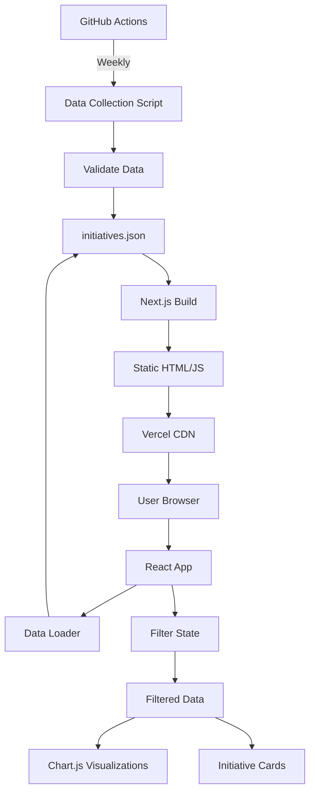

# Architecture Design: UK Government AI Visualization

## Architecture Overview

This document defines the deterministic architecture for a web-based visualization platform that tracks UK government AI objectives and work-in-progress. The system follows a static-first approach with client-side interactivity, enabling deployment on Vercel with weekly data updates via GitHub Actions.

### Core Components
- **Static Site Generator**: Next.js with SSG for Vercel deployment
- **Data Layer**: JSON-based storage with flexible schema
- **Visualization Engine**: Chart.js for interactive charts
- **Update Pipeline**: GitHub Actions for weekly data collection
- **Frontend**: React with TypeScript for type safety

## File Changes

### Project Structure
```
projects/visualise-government-ai-objectives-and-work-in-progress/
├── src/
│   ├── components/
│   │   ├── Chart.tsx
│   │   ├── FilterBar.tsx
│   │   ├── InitiativeCard.tsx
│   │   └── Layout.tsx
│   ├── data/
│   │   ├── initiatives.json
│   │   ├── schema.ts
│   │   └── loader.ts
│   ├── hooks/
│   │   └── useFilters.ts
│   ├── pages/
│   │   ├── index.tsx
│   │   └── _app.tsx
│   ├── styles/
│   │   └── globals.css
│   └── types/
│       └── index.ts
├── tests/
│   ├── components/
│   │   ├── Chart.test.tsx
│   │   └── FilterBar.test.tsx
│   ├── data/
│   │   └── loader.test.ts
│   └── e2e/
│       └── visualization.test.ts
├── scripts/
│   ├── collect-data.js
│   └── validate-data.js
├── .github/
│   └── workflows/
│       └── update-data.yml
├── package.json
├── tsconfig.json
├── next.config.js
└── vercel.json
```

### Files to Create/Modify

1. **`src/types/index.ts`** - TypeScript type definitions
2. **`src/data/schema.ts`** - Data validation schema
3. **`src/data/initiatives.json`** - Main data store
4. **`src/data/loader.ts`** - Data loading and transformation
5. **`src/components/Chart.tsx`** - Chart.js wrapper component
6. **`src/components/FilterBar.tsx`** - Filter controls
7. **`src/components/InitiativeCard.tsx`** - Initiative display card
8. **`src/components/Layout.tsx`** - Page layout wrapper
9. **`src/hooks/useFilters.ts`** - Filter state management
10. **`src/pages/index.tsx`** - Main visualization page
11. **`scripts/collect-data.js`** - Data collection script
12. **`.github/workflows/update-data.yml`** - Weekly update pipeline

## API Specifications

### Data Schema

```typescript
// src/types/index.ts

export interface Initiative {
  id: string;                    // Unique identifier
  title: string;                 // Initiative title
  description: string;           // Full description
  status: 'objective' | 'in-progress';  // Current status
  department: string;            // Responsible department
  category: Category;            // Primary category
  tags: string[];               // Additional tags
  dateAnnounced: string;        // ISO 8601 date
  dateUpdated: string;          // ISO 8601 date
  source: Source;               // Data source
  timeline?: Timeline;          // Optional timeline info
  budget?: number;              // Optional budget in GBP
  impact?: ImpactMetrics;       // Optional impact metrics
}

export interface Source {
  type: 'announcement' | 'blog' | 'statement' | 'news';
  url: string;
  title: string;
  date: string;
}

export interface Timeline {
  startDate?: string;
  endDate?: string;
  milestones?: Milestone[];
}

export interface Milestone {
  date: string;
  description: string;
  completed: boolean;
}

export interface ImpactMetrics {
  scope: 'national' | 'regional' | 'departmental';
  beneficiaries?: number;
  sectors?: string[];
}

export enum Category {
  HEALTHCARE = 'healthcare',
  DEFENSE = 'defense',
  EDUCATION = 'education',
  TRANSPORT = 'transport',
  JUSTICE = 'justice',
  FINANCE = 'finance',
  ENVIRONMENT = 'environment',
  RESEARCH = 'research',
  PUBLIC_SERVICES = 'public_services',
  GOVERNANCE = 'governance',
  OTHER = 'other'
}

export interface FilterState {
  departments: string[];
  categories: Category[];
  status: ('objective' | 'in-progress')[];
  dateRange: {
    start: Date | null;
    end: Date | null;
  };
  searchTerm: string;
}
```

### Data Loading API

```typescript
// src/data/loader.ts

export interface DataLoader {
  loadInitiatives(): Promise<Initiative[]>;
  filterInitiatives(data: Initiative[], filters: FilterState): Initiative[];
  aggregateByCategory(data: Initiative[]): CategoryAggregate[];
  aggregateByDepartment(data: Initiative[]): DepartmentAggregate[];
  aggregateByTimeline(data: Initiative[]): TimelineAggregate[];
}

export interface CategoryAggregate {
  category: Category;
  objectives: number;
  inProgress: number;
  total: number;
}

export interface DepartmentAggregate {
  department: string;
  initiatives: number;
  budget?: number;
}

export interface TimelineAggregate {
  month: string;
  announced: number;
  started: number;
  cumulative: number;
}
```

### Component Props

```typescript
// Component interfaces

export interface ChartProps {
  data: Initiative[];
  type: 'category' | 'department' | 'timeline';
  height?: number;
}

export interface FilterBarProps {
  filters: FilterState;
  onFilterChange: (filters: FilterState) => void;
  availableDepartments: string[];
  availableCategories: Category[];
}

export interface InitiativeCardProps {
  initiative: Initiative;
  onSelect?: (id: string) => void;
}
```

## Data Flow



### Data Collection Pipeline

1. **Trigger**: GitHub Actions cron job (weekly)
2. **Collection**: Script fetches from configured sources
3. **Validation**: Schema validation against TypeScript types
4. **Storage**: Update initiatives.json in repository
5. **Build**: Trigger Next.js rebuild on Vercel
6. **Deploy**: Automatic deployment with new data

### Client-Side Flow

1. **Load**: Page loads with embedded JSON data
2. **Parse**: Data loader parses and validates
3. **Filter**: User interactions update filter state
4. **Transform**: Data filtered and aggregated
5. **Render**: Chart.js and React components update

## Error Handling

### Data Collection Errors

```javascript
// scripts/collect-data.js

class DataCollectionError extends Error {
  constructor(source, originalError) {
    super(`Failed to collect from ${source}: ${originalError.message}`);
    this.source = source;
    this.originalError = originalError;
  }
}

// Retry logic with exponential backoff
async function fetchWithRetry(url, maxRetries = 3) {
  for (let i = 0; i < maxRetries; i++) {
    try {
      return await fetch(url);
    } catch (error) {
      if (i === maxRetries - 1) throw error;
      await new Promise(resolve => setTimeout(resolve, Math.pow(2, i) * 1000));
    }
  }
}
```

### Runtime Errors

```typescript
// src/data/loader.ts

export class DataLoadError extends Error {
  constructor(message: string, public details?: any) {
    super(message);
    this.name = 'DataLoadError';
  }
}

export class ValidationError extends Error {
  constructor(message: string, public field?: string) {
    super(message);
    this.name = 'ValidationError';
  }
}

// Error boundary for visualization components
export class VisualizationErrorBoundary extends React.Component {
  state = { hasError: false, error: null };
  
  static getDerivedStateFromError(error: Error) {
    return { hasError: true, error };
  }
  
  render() {
    if (this.state.hasError) {
      return <ErrorFallback error={this.state.error} />;
    }
    return this.props.children;
  }
}
```

### Edge Cases

1. **Empty Data**: Show meaningful empty state with instructions
2. **Invalid JSON**: Fall back to cached version, alert in console
3. **Network Failure**: Use service worker for offline access
4. **Large Dataset**: Implement virtual scrolling for cards
5. **Invalid Filters**: Reset to default state with notification
6. **Stale Data**: Show last update time prominently

## Testing Strategy

### Unit Tests

```typescript
// tests/data/loader.test.ts

describe('DataLoader', () => {
  it('should load initiatives from JSON', async () => {
    const data = await loader.loadInitiatives();
    expect(data).toBeInstanceOf(Array);
    expect(data[0]).toHaveProperty('id');
  });
  
  it('should filter by department', () => {
    const filtered = loader.filterInitiatives(mockData, {
      departments: ['Cabinet Office'],
      // ... other filters
    });
    expect(filtered.every(i => i.department === 'Cabinet Office')).toBe(true);
  });
  
  it('should aggregate by category correctly', () => {
    const aggregated = loader.aggregateByCategory(mockData);
    const healthcare = aggregated.find(a => a.category === Category.HEALTHCARE);
    expect(healthcare.total).toBe(healthcare.objectives + healthcare.inProgress);
  });
});
```

### Component Tests

```typescript
// tests/components/FilterBar.test.tsx

describe('FilterBar', () => {
  it('should render all filter controls', () => {
    render(<FilterBar {...mockProps} />);
    expect(screen.getByLabelText('Department')).toBeInTheDocument();
    expect(screen.getByLabelText('Category')).toBeInTheDocument();
    expect(screen.getByLabelText('Status')).toBeInTheDocument();
  });
  
  it('should call onFilterChange when filters update', () => {
    const onChange = jest.fn();
    render(<FilterBar {...mockProps} onFilterChange={onChange} />);
    
    fireEvent.change(screen.getByLabelText('Department'), {
      target: { value: 'DHSC' }
    });
    
    expect(onChange).toHaveBeenCalledWith(expect.objectContaining({
      departments: ['DHSC']
    }));
  });
});
```

### E2E Tests

```typescript
// tests/e2e/visualization.test.ts

describe('Visualization Page', () => {
  beforeEach(() => {
    cy.visit('/');
  });
  
  it('should load and display initiatives', () => {
    cy.get('[data-testid="initiative-card"]').should('have.length.greaterThan', 0);
  });
  
  it('should filter by department', () => {
    cy.get('[data-testid="department-filter"]').select('Cabinet Office');
    cy.get('[data-testid="initiative-card"]').each(($card) => {
      cy.wrap($card).should('contain', 'Cabinet Office');
    });
  });
  
  it('should update charts when filters change', () => {
    cy.get('[data-testid="status-filter"]').click();
    cy.get('[value="in-progress"]').click();
    cy.get('[data-testid="chart-container"]').should('be.visible');
    // Verify chart updated (check for specific data point)
  });
});
```

### Performance Tests

- Initial load time < 3 seconds
- Filter updates < 100ms
- Chart animations < 500ms
- Memory usage < 50MB for 1000 initiatives

## Implementation Order

### Phase 1: Foundation (Week 1)
1. Set up Next.js project with TypeScript
2. Create type definitions (`src/types/index.ts`)
3. Implement data schema (`src/data/schema.ts`)
4. Create sample data file (`src/data/initiatives.json`)
5. Build data loader (`src/data/loader.ts`)
6. Write unit tests for data layer

### Phase 2: Core Components (Week 1-2)
1. Create Layout component
2. Build FilterBar component
3. Implement InitiativeCard component
4. Add Chart wrapper component
5. Write component tests

### Phase 3: Integration (Week 2)
1. Build main page (`src/pages/index.tsx`)
2. Implement filter hooks
3. Connect data flow
4. Add error boundaries
5. Write E2E tests

### Phase 4: Data Pipeline (Week 2-3)
1. Create data collection script
2. Add validation script
3. Set up GitHub Actions workflow
4. Test pipeline end-to-end

### Phase 5: Deployment (Week 3)
1. Configure Vercel deployment
2. Set up environment variables
3. Add monitoring/logging
4. Create deployment documentation

### Phase 6: Polish (Week 3-4)
1. Optimize performance
2. Add accessibility features
3. Implement PWA features
4. Complete documentation

## Deployment Configuration

### Vercel Settings
```json
// vercel.json
{
  "buildCommand": "npm run build",
  "outputDirectory": ".next",
  "framework": "nextjs",
  "regions": ["lhr1"],
  "env": {
    "NODE_ENV": "production",
    "NEXT_PUBLIC_UPDATE_FREQUENCY": "weekly"
  }
}
```

### GitHub Actions Workflow
```yaml
# .github/workflows/update-data.yml
name: Update Data
on:
  schedule:
    - cron: '0 9 * * 1'  # Weekly on Monday 9am
  workflow_dispatch:

jobs:
  update:
    runs-on: ubuntu-latest
    steps:
      - uses: actions/checkout@v4
      - uses: actions/setup-node@v4
      - run: npm ci
      - run: npm run collect-data
      - run: npm run validate-data
      - uses: peter-evans/create-pull-request@v5
        with:
          commit-message: 'chore: weekly data update'
          branch: data-update
          title: 'Weekly Data Update'
```

## Category System Proposal

Based on UK government structure and AI application domains:

### Primary Categories
1. **Healthcare** - NHS, DHSC initiatives
2. **Defense** - MOD, national security applications
3. **Education** - DfE, skills training programs
4. **Transport** - DfT, infrastructure optimization
5. **Justice** - MOJ, legal tech, crime prevention
6. **Finance** - HMT, HMRC, economic modeling
7. **Environment** - DEFRA, climate analysis
8. **Research** - UKRI, academic partnerships
9. **Public Services** - DWP, Home Office services
10. **Governance** - Cabinet Office, GDS platforms

### Secondary Tags
- Automation
- Decision Support
- Natural Language Processing
- Computer Vision
- Predictive Analytics
- Process Optimization
- Citizen Services
- Data Infrastructure
- Ethics & Safety
- Skills & Training

This categorization allows filtering by primary domain while tags enable cross-cutting theme exploration.